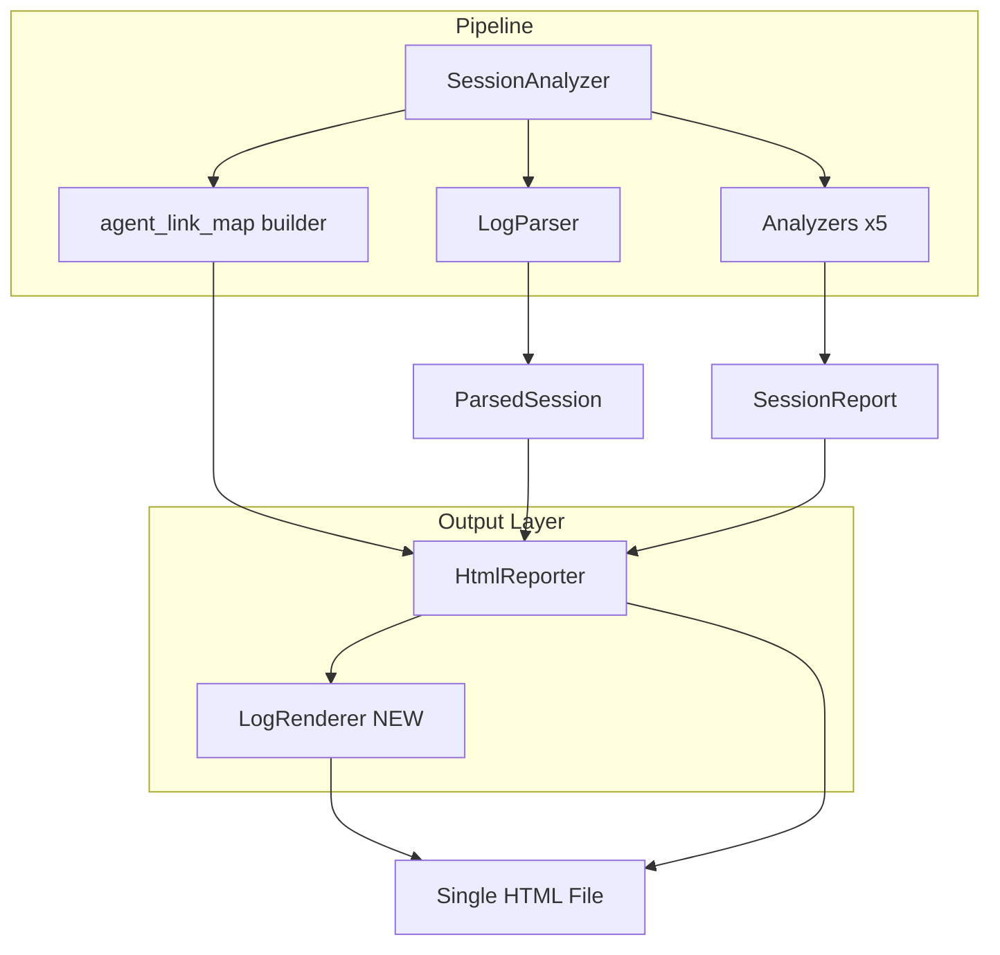
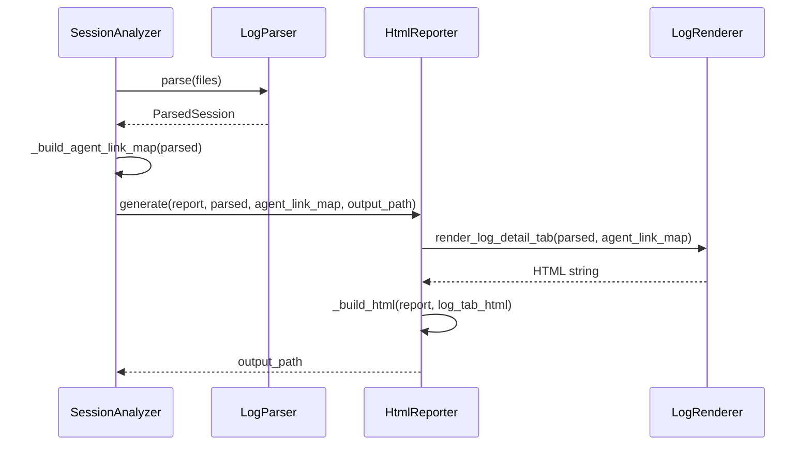

# 技術設計書: log-detail-view

## Overview

**Purpose**: 本機能は、Session Analyzer の HTML レポートに「ログ詳細」タブを追加し、メインセッションおよびすべてのサブエージェントの全ログエントリを閲覧可能にする。メインログ内のサブエージェント起動箇所から対応するサブエージェントセクションへのページ内リンクを提供し、開発者がセッションの実行フローを詳細に追跡できるようにする。

**Users**: Claude Code 開発者が、セッション後に生成された単一 HTML ファイルをブラウザで開き、ツール呼び出し・思考ログ・サブエージェントの動作を詳細に確認するために使用する。

**Impact**: 既存の `HtmlReporter.generate()` インターフェースと `SessionAnalyzer.run()` を変更し、`ParsedSession` をレポーターに渡すパイプラインに拡張する。新モジュール `log_renderer.py` を追加する。

### Goals

- メインセッションの全ログエントリ（user/assistant、全 ContentBlock バリアント）を時系列で表示する
- 各サブエージェントの全ログエントリを個別セクションで表示する
- メインログの Agent/Task ToolUseBlock からサブエージェントセクションへのページ内リンクを提供する
- 既存の外部依存ゼロ・`file://` 直接表示を維持しつつ単一 HTML ファイルで完結させる

### Non-Goals

- ログのフィルタリング・検索機能（将来の拡張）
- リアルタイムログ監視
- 既存の 5 分析タブ（トークン・スキル・ツール・サブエージェント・思考ログ）の変更
- サブエージェント ID とファイル名の完全 ID ベース対応（位置ベースマッチングを採用）

---

## Architecture

### Existing Architecture Analysis

- **パイプライン**: `LogDiscovery → LogParser → 5 Analyzers → HtmlReporter`
- **`ParsedSession`**: `main_entries: list[LogEntry]` と `subagent_entries: dict[str, list[LogEntry]]` をすでに保持しており、パーサー変更は不要
- **`HtmlReporter`**: `_TAB_DEFS` リストとタブパネル生成パターンが拡張ポイントとして機能する
- **`_esc()`**: XSS 防止のエスケープ関数が `reporter.py` に定義済み
- **`<details>/<summary>`**: ThinkingBlock の折りたたみ表示パターンが既存利用されており、ToolUseBlock 表示に流用可能

### Architecture Pattern & Boundary Map



**Architecture Integration**:
- **選択パターン**: パイプライン型拡張（既存パターンを維持）
- **境界**: `log_renderer.py` がログ HTML レンダリングの責務を単独で担う。`reporter.py` はオーケストレーションのみ
- **保持するパターン**: Python サーバーサイドレンダリング、`_esc()` による XSS 防止、外部依存ゼロ
- **新規コンポーネントの理由**: `reporter.py` の肥大化を回避し、ログレンダリングロジックを独立してテスト可能にするため

### Technology Stack

| Layer | Choice / Version | Role in Feature | Notes |
|-------|------------------|-----------------|-------|
| 言語 | Python 3.14 | ログ HTML のサーバーサイドレンダリング | 変更なし |
| HTML/CSS | バニラ HTML5 + インライン CSS | スクロール可能ログコンテナ、ロールバッジ、ToolUseBlock 折りたたみ | 既存 CSS 変数を拡張 |
| JS | バニラ JS（インライン） | 1,000 件超時の遅延表示トグル、ページ内リンク | 外部ライブラリなし |
| データ | `ParsedSession`（既存モデル） | ログエントリの供給元 | 新規モデル不要 |

---

## System Flows



---

## Requirements Traceability

| Requirement | Summary | Components | Interfaces | Flows |
|-------------|---------|------------|------------|-------|
| 1.1 | メイン全エントリを時系列表示 | LogRenderer | `render_log_detail_tab` | LogParser → LogRenderer |
| 1.2 | ロール・タイムスタンプ・コンテンツ表示 | LogRenderer | `_render_entry` | — |
| 1.3 | ToolUseBlock の識別表示 | LogRenderer | `_render_content_block` | — |
| 1.4 | ThinkingBlock の折りたたみ表示 | LogRenderer | `_render_content_block` | — |
| 1.5 | エントリなし時のメッセージ表示 | LogRenderer | `render_log_detail_tab` | — |
| 2.1 | 各サブエージェント個別詳細ビュー | LogRenderer | `render_log_detail_tab` | — |
| 2.2 | サブエージェント全エントリ時系列表示 | LogRenderer | `_render_subagent_section` | — |
| 2.3 | agent_id ヘッダー表示 | LogRenderer | `_render_subagent_section` | — |
| 2.4 | メインセッションへ戻るナビゲーション | LogRenderer | `_render_subagent_section` | — |
| 2.5 | サブエージェントなし時の非表示 | LogRenderer | `render_log_detail_tab` | — |
| 3.1 | Agent/Task 起動エントリへのリンク表示 | LogRenderer, SessionAnalyzer | `_build_agent_link_map`, `_render_content_block` | SessionAnalyzer → LogRenderer |
| 3.2 | ページ内スクロール | HtmlReporter（JS） | `_JS` 拡張 | — |
| 3.3 | サブエージェント起動エントリのハイライト | LogRenderer | `_render_content_block` CSS class | — |
| 3.4 | 対応サブエージェント不在時はリンク非表示 | LogRenderer | `_render_content_block` | — |
| 4.1 | 単一 HTML ファイルへの統合 | HtmlReporter | `_build_html` 拡張 | — |
| 4.2 | 外部依存なし・file:// 完全動作 | 全コンポーネント | — | — |
| 4.3 | SESSION_DATA インライン埋め込み形式の維持 | HtmlReporter | `_build_html` | — |
| 4.4 | 既存ナビゲーションからのリンク提供 | HtmlReporter | `_TAB_DEFS` 拡張 | — |
| 4.5 | 1,000 件超のパフォーマンス維持 | LogRenderer, HtmlReporter（JS） | JS トグル | — |

---

## Components and Interfaces

### コンポーネント概要

| Component | Domain/Layer | Intent | Req Coverage | Key Dependencies | Contracts |
|-----------|--------------|--------|--------------|-----------------|-----------|
| LogRenderer | HTML Generation | ログエントリを HTML 文字列にレンダリング | 1.1–1.5, 2.1–2.5, 3.1–3.4, 4.5 | ParsedSession (P0), reporter._esc (P1) | Service |
| HtmlReporter（拡張） | HTML Generation | LogRenderer を統合し HTML タブとして組み込む | 4.1–4.4 | LogRenderer (P0), SessionReport (P0) | Service |
| SessionAnalyzer（拡張） | Orchestration | agent_link_map を構築し HtmlReporter に渡す | 3.1 | ParsedSession (P0) | Service |

---

### HTML Generation Layer

#### LogRenderer

| Field | Detail |
|-------|--------|
| Intent | `ParsedSession` のログエントリを「ログ詳細」タブの HTML 文字列にレンダリングする |
| Requirements | 1.1, 1.2, 1.3, 1.4, 1.5, 2.1, 2.2, 2.3, 2.4, 2.5, 3.1, 3.3, 3.4, 4.5 |

**Responsibilities & Constraints**
- `ParsedSession.main_entries` と `subagent_entries` を HTML に変換する唯一の責務を持つ
- `_esc()` を使用して全テキストを HTML エスケープする（XSS 防止）
- 外部ライブラリへの依存を持たない

**Dependencies**
- Inbound: `HtmlReporter` — HTML 文字列の取得（P0）
- Outbound: `session_analyzer.models.ParsedSession`, `LogEntry`, `ContentBlock` — データ源（P0）
- External: `reporter._esc` — HTML エスケープ（P1）※ 実装上 `reporter.py` から import するか、`log_renderer.py` に同一関数を定義する

**Contracts**: Service [x]

##### Service Interface

```python
# session_analyzer/log_renderer.py
from session_analyzer.models import ParsedSession

def render_log_detail_tab(
    parsed: ParsedSession,
    agent_link_map: dict[str, str],
) -> str:
    """
    「ログ詳細」タブ全体の HTML 文字列を返す。

    Args:
        parsed: パース済みセッション（main + subagent エントリ）
        agent_link_map: ToolUseBlock.id → subagent_entries キー のマッピング

    Returns:
        タブパネル内部の HTML 文字列（<div class="card"> 群）
    """
```

**Private Functions（実装の参考、インターフェース契約ではない）**:
- `_render_content_block(block: ContentBlock, agent_link_map: dict[str, str]) -> str` — ContentBlock バリアント別 HTML 生成
- `_render_entry(entry: LogEntry, agent_link_map: dict[str, str]) -> str` — 単一ログエントリの HTML 生成
- `_render_log_entries(entries: list[LogEntry], agent_link_map: dict[str, str]) -> str` — エントリリストの HTML 生成（1,000 件超対応）
- `_render_subagent_section(agent_id: str, entries: list[LogEntry], agent_link_map: dict[str, str]) -> str` — サブエージェントセクション HTML 生成

**Preconditions**:
- `parsed.main_entries` は時系列順のリスト（パーサー保証）
- `agent_link_map` キーは `ToolUseBlock.id` と一致する文字列

**Postconditions**:
- 返す HTML は XSS エスケープ済み
- `agent_link_map` に対応エントリがない ToolUseBlock はリンクなしで表示される（4.4 相当の graceful degradation）

**Implementation Notes**:
- `<details>/<summary>` パターン（既存 thinking セクションと同一）を ToolUseBlock の入力 JSON 表示および ThinkingBlock に適用
- Agent/Task ToolUseBlock にはハイライト CSS クラス（例: `agent-launch`）と `<a href="#subagent-{agent_id}">` を付与
- 1,000 件超の場合: `data-log-entry` 属性でエントリを識別し、201 件目以降は `class="log-entry-hidden"` を付与。JS が「残りを表示」ボタンを制御する

---

#### HtmlReporter（拡張）

| Field | Detail |
|-------|--------|
| Intent | LogRenderer を統合し、ログ詳細タブを HTML レポートに組み込む |
| Requirements | 4.1, 4.2, 4.3, 4.4 |

**Responsibilities & Constraints**
- `_TAB_DEFS` に `("tab-log", "ログ詳細")` を追加する
- `_build_html()` および `generate()` のシグネチャを変更し `parsed: ParsedSession` と `agent_link_map` を受け取る
- `SESSION_DATA` の形式（`SessionReport` の JSON 埋め込み）は変更しない（4.3）

**Dependencies**
- Inbound: `SessionAnalyzer` — `generate()` の呼び出し元（P0）
- Outbound: `LogRenderer.render_log_detail_tab` — ログタブ HTML（P0）

**Contracts**: Service [x]

##### Service Interface

```python
# session_analyzer/reporter.py（変更後）
class HtmlReporter:
    def generate(
        self,
        report: SessionReport,
        parsed: ParsedSession,
        agent_link_map: dict[str, str],
        output_path: Path,
    ) -> Path:
        """
        HTML ファイルを生成して output_path に書き込む。

        Returns: 書き込んだファイルの絶対パス
        Raises: ReportGenerationError
        """
```

**Implementation Notes**:
- `_build_html(report, log_tab_html)` → `log_tab_html: str` を引数として受け取り、タブパネルに組み込む
- JS 拡張: 「残りを表示」ボタンのクリックハンドラーを `_JS` 文字列に追加する

---

#### SessionAnalyzer（拡張）

| Field | Detail |
|-------|--------|
| Intent | `agent_link_map` を構築し、`HtmlReporter.generate()` に渡す |
| Requirements | 3.1 |

**Responsibilities & Constraints**
- `ParsedSession` の `main_entries` を走査し、Agent/Task ToolUseBlock の登場順に `subagent_entries` キーを対応付ける
- 対応付けは位置ベース（`research.md` の設計判断を参照）

**Contracts**: Service [x]

##### Service Interface

```python
# session_analyzer/session_analyzer.py（内部メソッド追加）
def _build_agent_link_map(parsed: ParsedSession) -> dict[str, str]:
    """
    Agent/Task ToolUseBlock.id → subagent_entries キー のマッピングを構築する。

    位置ベースマッチング: N 番目の Agent/Task 呼び出し → N 番目のサブエージェントキー（挿入順）

    Args:
        parsed: パース済みセッション

    Returns:
        ToolUseBlock.id → subagent_entries のキー文字列 のマッピング
        対応するサブエージェントが存在しない呼び出しはマッピングに含まれない
    """
```

**Preconditions**:
- `parsed.subagent_entries` の挿入順は `discovery.py` の `sorted(...)` 呼び出し順に一致する

**Implementation Notes**:
- `_SUBAGENT_TOOL_NAMES = {"Task", "Agent"}` は `subagent.py` と共通定義を参照するか、同値を使用する
- 既知の制限: サブエージェントがキャンセル・失敗した場合に位置がずれる可能性あり

---

## Data Models

### Domain Model

本機能で新たなドメインモデルは導入しない。以下の既存モデルをそのまま利用する。

| Model | 利用目的 |
|-------|---------|
| `ParsedSession` | main_entries・subagent_entries の供給 |
| `AssistantEntry` | ロール・タイムスタンプ・ContentBlock リスト |
| `UserEntry` | ロール・タイムスタンプ・コンテンツ（文字列 or ContentBlock リスト） |
| `ToolUseBlock` | ツール名・入力パラメータ・ID（Agent/Task リンク先特定に使用） |
| `ThinkingBlock` | 思考テキスト（折りたたみ表示） |
| `TextBlock` | プレーンテキスト |
| `ToolResultBlock` | ツール実行結果・エラーフラグ |

### Data Contracts & Integration

`agent_link_map: dict[str, str]` が `SessionAnalyzer` → `HtmlReporter` → `LogRenderer` を横断する唯一の新規データ。
スキーマ: `{ "<ToolUseBlock.id>": "<subagent_entries のキー文字列>" }`

---

## Error Handling

### Error Strategy

- **入力エラー**: `parsed.main_entries` が空の場合、"ログエントリが見つかりません" メッセージを HTML で表示する（例外を送出しない）
- **ID マッピング失敗**: `agent_link_map` に対応キーがない ToolUseBlock はリンクなしで通常表示する（graceful degradation）
- **エスケープ漏れ防止**: すべてのユーザー由来テキスト（ログコンテンツ）は `_esc()` を経由する

### Error Categories and Responses

- **ログエントリなし（User Error 相当）**: `render_log_detail_tab` が空文字列の代わりに「ログエントリが見つかりません」HTML を返す（1.5, 2.5）
- **サブエージェントログなし**: サブエージェントセクションを HTML に含めない（2.5）
- **XSS**: `_esc()` による HTML エスケープを全テキストに適用する（セキュリティ制御）

### Monitoring

- 既存の `[WARNING] JSON parse error` をパーサー側で出力（変更なし）
- `ReportGenerationError` は `HtmlReporter.generate()` で既存どおり送出する

---

## Testing Strategy

### Unit Tests (`tests/test_log_renderer.py`)

- `render_log_detail_tab`: `main_entries` が空の場合に "ログエントリが見つかりません" を含む HTML を返す
- `render_log_detail_tab`: `TextBlock` を含む `AssistantEntry` が正しく HTML に変換される
- `render_log_detail_tab`: `ToolUseBlock(name="Agent")` にハイライト class とアンカーリンクが付与される
- `render_log_detail_tab`: `agent_link_map` に対応エントリがない場合はリンクなしで表示される
- `render_log_detail_tab`: `ThinkingBlock` が `<details>` 要素として折りたたまれる
- `render_log_detail_tab`: `subagent_entries` が空の場合にサブエージェントセクションが出力されない
- `render_log_detail_tab`: エントリ数が 1,001 件の場合に JS トグルボタン要素が出力される

### Unit Tests (`tests/test_session_analyzer.py`)

- `_build_agent_link_map`: Agent ToolUseBlock が 2 件、サブエージェントキーが 2 件の場合に正しくマッピングされる
- `_build_agent_link_map`: Agent 呼び出し数よりサブエージェント数が少ない場合、超過分はマッピングに含まれない

### Integration Tests

- `HtmlReporter.generate()`: `ParsedSession` を渡した場合、生成 HTML に "ログ詳細" タブが含まれる
- `HtmlReporter.generate()`: `<section id="subagent-{agent_id}">` アンカーが生成 HTML に存在する
- `SessionAnalyzer.run()`: サンプルログを使用して HTML が正常生成される（既存 E2E テスト拡張）

### HTML Rendering Verification

- XSS インジェクション文字列（`<script>`, `"`, `&`）を含むログエントリが正しくエスケープされる
- `file://` プロトコルでの動作（外部リソース参照なし）

---

## Performance & Scalability

- **対象**: 1,000 件超のログエントリ時の表示パフォーマンス（要件 4.5）
- **戦略**: Python 側で全エントリを HTML 文字列として生成（DOM 事前構築）。201 件目以降のエントリに `class="log-entry-hidden"` を付与し `display: none` で非表示。バニラ JS の「残りを表示」ボタンで `display: block` に切り替え
- **CSS**: ログエントリコンテナに `max-height: 600px; overflow-y: auto` を設定し、初期レンダリングの表示範囲を制限
- **ファイルサイズ**: 大量ログ時に HTML ファイルが数 MB に達する可能性あり。許容範囲として扱う（`file://` での直接開封は対応）
