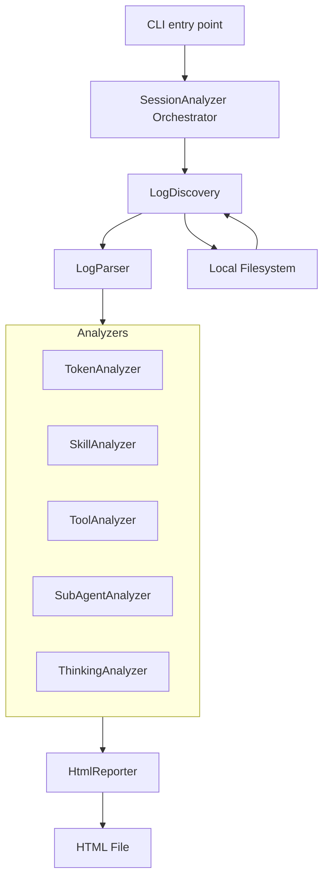
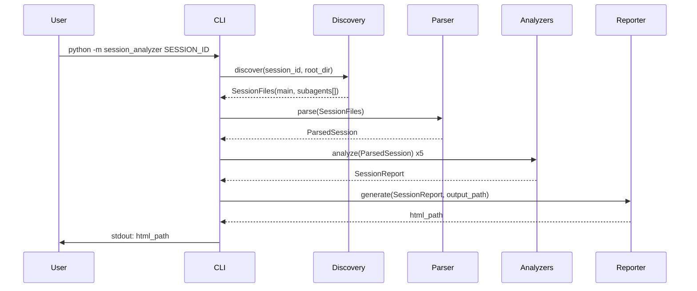
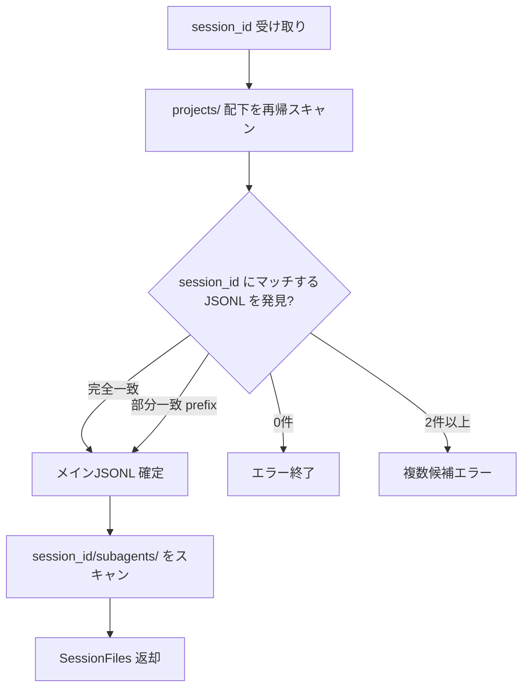

# 設計ドキュメント: Session Analyzer

## Overview

Session Analyzer は、Claude Code のセッションログ（JSONL 形式）を解析し、トークン使用量・スキル利用・ツール操作・サブエージェント・思考ログを一覧できる自己完結型 HTML レポートを生成する Python CLI ツールである。

**Purpose**: エージェントスキルまたは手動実行で呼び出され、指定されたセッションの全活動をブラウザで可視化することで、開発者がコスト把握・動作振り返り・デバッグを効率的に行えるようにする。

**Users**: Claude Code を利用する開発者が、セッション終了後の振り返りや料金確認に使用する。

**Impact**: 外部サービス・データベース不要。入力はローカルの JSONL ファイル群、出力は単一の HTML ファイル。

### Goals

- セッション ID 指定のみでレポートを生成できる（探索自動化）
- `file://` プロトコルで完全動作する自己完結型 HTML を出力する
- 標準ライブラリのみで実装し、追加インストール不要で実行できる

### Non-Goals

- リアルタイム監視・ライブ更新
- 複数セッションの横断比較
- ログファイルの書き込み・編集
- Web サーバー機能

---

## Requirements Traceability

| 要件 | サマリー | コンポーネント | インターフェース |
|------|----------|---------------|-----------------|
| 1.1–1.6 | セッションIDからJSONLファイルを特定 | `LogDiscovery` | `discover()` |
| 2.1–2.6 | トークン集計・コスト推定 | `TokenAnalyzer` | `analyze()` |
| 3.1–3.5 | スキル使用サマリー | `SkillAnalyzer` | `analyze()` |
| 4.1–4.8 | ツール使用サマリー・Bashコマンド集計 | `ToolAnalyzer` | `analyze()` |
| 5.1–5.5 | サブエージェントサマリー | `SubAgentAnalyzer` | `analyze()` |
| 6.1–6.5 | 思考ログビュー | `ThinkingAnalyzer` | `analyze()` |
| 7.1–7.7 | HTML レポート出力 | `HtmlReporter` | `generate()` |
| 8.1–8.6 | CLI インターフェース | `CLI` | `main()` |

---

## Architecture

### Architecture Pattern & Boundary Map

Pipeline / ETL パターンを採用する。Extract（ログ探索・解析） → Transform（5種のアナライザー） → Load（HTML 生成）の3段階で処理が流れる。



**選択パターン**: Pipeline / ETL — データ量が小さく逐次処理で十分。各ステージが独立しており単体テストが容易（詳細は `research.md` 参照）。

### Technology Stack

| Layer | Choice | Role | Notes |
|-------|--------|------|-------|
| CLI | Python 3.11+ `argparse` | コマンドライン引数解析 | 標準ライブラリ |
| Core | Python `dataclasses`, `json`, `pathlib` | ログ解析・ドメインモデル | 標準ライブラリのみ（外部依存ゼロ） |
| Reporting | Python 文字列テンプレート | HTML 生成 | Jinja2 等は不使用 |
| Frontend | Vanilla JS + Inline CSS | インタラクティブHTML表示 | CDN 不使用、`file://` 完全対応 |

---

## System Flows

### メイン実行フロー



### ファイル探索フロー



---

## Components and Interfaces

### コンポーネントサマリー

| Component | Layer | Intent | Req Coverage | Key Dependencies |
|-----------|-------|--------|--------------|------------------|
| `CLI` | Entry | 引数解析・実行制御 | 8.1–8.6 | `SessionAnalyzer` (P0) |
| `SessionAnalyzer` | Core | パイプライン全体のオーケストレーション | 全体 | 全コンポーネント (P0) |
| `LogDiscovery` | Core | JSONL ファイルパス探索 | 1.1–1.6 | `pathlib.Path` (P0) |
| `LogParser` | Core | JSONL 解析・ドメインオブジェクト変換 | 1.4 | `json` (P0) |
| `TokenAnalyzer` | Analysis | トークン集計・コスト推定 | 2.1–2.6 | `ParsedSession` (P0) |
| `SkillAnalyzer` | Analysis | スキル呼び出し分類・集計 | 3.1–3.5 | `ParsedSession` (P0) |
| `ToolAnalyzer` | Analysis | ツール使用・Bash コマンド集計 | 4.1–4.8 | `ParsedSession` (P0) |
| `SubAgentAnalyzer` | Analysis | サブエージェント情報集計 | 5.1–5.5 | `ParsedSession` (P0) |
| `ThinkingAnalyzer` | Analysis | thinking ブロック抽出・整理 | 6.1–6.5 | `ParsedSession` (P0) |
| `HtmlReporter` | Reporting | HTML ファイル生成 | 7.1–7.7 | `SessionReport` (P0) |

---

### Entry Layer

#### CLI

| Field | Detail |
|-------|--------|
| Intent | コマンドライン引数を解析し、SessionAnalyzer を実行して結果を出力する |
| Requirements | 8.1, 8.2, 8.3, 8.4, 8.5, 8.6 |

**Responsibilities & Constraints**
- `argparse` を使って引数・オプションを解析する
- 環境変数 `CLAUDE_CONFIG_DIR` を `--claude-dir` の fallback として使用する
- 成功時は HTML ファイルパスを stdout に出力し exit code 0 で終了する
- エラー時は説明メッセージを stderr に出力し exit code 1 で終了する

**Dependencies**
- Outbound: `SessionAnalyzer` — パイプライン実行 (P0)

**Contracts**: Service [x]

##### Service Interface

```python
def main(argv: list[str] | None = None) -> int:
    """エントリポイント。argv=None のとき sys.argv を使用。終了コードを返す。"""

# argparse 設定
# positional: session_id (str)
# optional:   --output / -o (str, default: "session-{session_id}.html")
# optional:   --claude-dir (str, default: CLAUDE_CONFIG_DIR env or $HOME/.claude)
```

---

### Core Layer

#### LogDiscovery

| Field | Detail |
|-------|--------|
| Intent | 指定されたセッション ID に対応する JSONL ファイルパスを探索し返す |
| Requirements | 1.1, 1.2, 1.3, 1.4, 1.5, 1.6 |

**Responsibilities & Constraints**
- `root_dir / projects` 配下を再帰スキャンして `*.jsonl` を列挙する
- 完全一致優先、次いで prefix 一致でファイルを特定する
- 複数マッチした場合は曖昧エラーを raise する
- サブエージェント JSONL は `{session_dir}/{session_id}/subagents/agent-*.jsonl` パターンで探索する

**Dependencies**
- External: `pathlib.Path` — ファイルシステム操作 (P0)

**Contracts**: Service [x]

##### Service Interface

```python
@dataclass(frozen=True)
class SessionFiles:
    main: Path
    subagents: list[Path]  # 発見されたサブエージェントJSONL一覧

class LogDiscovery:
    def discover(
        self,
        session_id: str,
        root_dir: Path,
    ) -> SessionFiles:
        """
        セッションIDに対応するJSONLファイルを探索する。
        Raises:
            SessionNotFoundError: マッチするファイルが存在しない
            AmbiguousSessionError: 複数のファイルがマッチした
        """
```

**Implementation Notes**
- Validation: session_id が UUID 形式でない場合も prefix マッチで許容する
- Risks: `projects/` 配下のファイル数が多い場合のスキャン速度。現状は許容範囲内と判断（数千ファイル程度）

---

#### LogParser

| Field | Detail |
|-------|--------|
| Intent | JSONL ファイルを1行ずつ読み込み、型付きドメインオブジェクトに変換する |
| Requirements | 1.4 |

**Responsibilities & Constraints**
- ストリーミング読み込み（行単位）でメモリ効率を確保する
- 不明な `type` フィールドや未知フィールドは無視して防御的に処理する
- 解析エラー（不正 JSON）は該当行をスキップしてログを継続する

**Dependencies**
- External: `json` — JSON パース (P0)

**Contracts**: Service [x]

##### Service Interface

```python
@dataclass
class ParsedSession:
    session_id: str
    main_entries: list[LogEntry]
    subagent_entries: dict[str, list[LogEntry]]  # agentId -> entries

class LogParser:
    def parse(self, files: SessionFiles) -> ParsedSession:
        """SessionFilesを解析してParsedSessionを返す"""
```

---

### Analysis Layer

各アナライザーは `ParsedSession` を受け取り、特定の観点での分析結果を返す共通パターンを持つ。

#### TokenAnalyzer

| Field | Detail |
|-------|--------|
| Intent | 全ログからトークン使用量を集計し、モデル別集計とコスト推定を算出する |
| Requirements | 2.1, 2.2, 2.3, 2.4, 2.5, 2.6 |

**Contracts**: Service [x]

##### Service Interface

```python
@dataclass
class TokenUsageStats:
    model: str
    input_tokens: int
    output_tokens: int
    cache_creation_tokens: int
    cache_read_tokens: int
    estimated_cost_usd: float | None  # 未知モデルはNone

@dataclass
class TokenReport:
    by_model: list[TokenUsageStats]
    total: TokenUsageStats  # 全モデル合計（cost は合計）

class TokenAnalyzer:
    # 料金定数（MTok あたり USD）
    PRICING: dict[str, dict[str, float]] = {
        "claude-opus-4-6": {"input": 15.0, "output": 75.0, "cache_write": 18.75, "cache_read": 1.50},
        "claude-sonnet-4-6": {"input": 3.0, "output": 15.0, "cache_write": 3.75, "cache_read": 0.30},
        "claude-haiku-4-5-20251001": {"input": 0.80, "output": 4.0, "cache_write": 1.00, "cache_read": 0.08},
    }

    def analyze(self, session: ParsedSession) -> TokenReport: ...
```

---

#### SkillAnalyzer

| Field | Detail |
|-------|--------|
| Intent | `<command-name>` タグを持つ user メッセージを検出し、起動方法別に分類・集計する |
| Requirements | 3.1, 3.2, 3.3, 3.4, 3.5 |

**Contracts**: Service [x]

##### Service Interface

```python
from enum import StrEnum

class InvocationMethod(StrEnum):
    USER_SLASH_COMMAND = "ユーザー起動（スラッシュコマンド）"
    LLM_AUTO = "LLM自動起動"

@dataclass
class SkillInvocation:
    skill_name: str
    method: InvocationMethod
    timestamp: str
    uuid: str

@dataclass
class SkillReport:
    invocations: list[SkillInvocation]          # 時系列順
    summary: dict[str, int]                      # skill_name -> count

class SkillAnalyzer:
    def analyze(self, session: ParsedSession) -> SkillReport: ...
```

**Implementation Notes**
- `isMeta: true` を LLM自動起動の判定条件とする
- `<command-name>` タグは正規表現で抽出する

---

#### ToolAnalyzer

| Field | Detail |
|-------|--------|
| Intent | `tool_use` ブロックを集計し、Bash コマンドの詳細一覧と集計サマリーを提供する |
| Requirements | 4.1, 4.2, 4.3, 4.4, 4.5, 4.6, 4.7, 4.8 |

**Contracts**: Service [x]

##### Service Interface

```python
# サブコマンド展開対象コマンド
SUBCOMMAND_TARGETS: frozenset[str] = frozenset({"git", "docker", "mvn", "npm", "uv"})

@dataclass
class BashInvocation:
    command: str          # 実行されたコマンド文字列
    is_error: bool
    error_message: str | None
    timestamp: str
    source: str           # "main" or agent_id

@dataclass
class CommandAggregation:
    base_command: str
    count: int
    sub_commands: dict[str, int]  # サブコマンド展開対象のみ populated

@dataclass
class ToolReport:
    tool_counts: dict[str, int]               # tool_name -> count
    bash_invocations: list[BashInvocation]    # 全Bash実行一覧（時系列）
    bash_aggregation: list[CommandAggregation]  # ベースコマンド別集計（降順）

class ToolAnalyzer:
    def analyze(self, session: ParsedSession) -> ToolReport: ...
```

**Implementation Notes**
- Bash コマンドの `tool_result` は対応する `tool_use_id` で紐づける
- コマンド文字列のパース: `shlex.split` でトークン分割し、`[0]` をベースコマンド、`[1]` をサブコマンドとする
- パイプやリダイレクトを含む複雑なコマンドでは先頭トークンのみ抽出

---

#### SubAgentAnalyzer

| Field | Detail |
|-------|--------|
| Intent | Task/Agent ツール呼び出しを検出し、サブエージェントの概要と使用トークンを集計する |
| Requirements | 5.1, 5.2, 5.3, 5.4, 5.5 |

**Contracts**: Service [x]

##### Service Interface

```python
@dataclass
class SubAgentInfo:
    agent_id: str
    tool_name: str               # "Task" or "Agent"
    subagent_type: str | None    # e.g. "Explore"
    prompt: str                  # description または prompt フィールド
    launched_at: str             # timestamp
    token_usage: TokenUsageStats | None  # サブエージェントログがある場合

@dataclass
class SubAgentReport:
    agents: list[SubAgentInfo]   # 起動順

class SubAgentAnalyzer:
    def analyze(self, session: ParsedSession) -> SubAgentReport: ...
```

---

#### ThinkingAnalyzer

| Field | Detail |
|-------|--------|
| Intent | thinking ブロックを全ログから抽出し、時系列で整理する |
| Requirements | 6.1, 6.2, 6.3, 6.4, 6.5 |

**Contracts**: Service [x]

##### Service Interface

```python
@dataclass
class ThinkingEntry:
    content: str         # thinking テキスト
    message_uuid: str    # 紐づく assistant メッセージの UUID
    timestamp: str
    source: str          # "main" or agent_id

@dataclass
class ThinkingReport:
    entries: list[ThinkingEntry]  # 時系列順
    has_thinking: bool

class ThinkingAnalyzer:
    def analyze(self, session: ParsedSession) -> ThinkingReport: ...
```

---

### Reporting Layer

#### HtmlReporter

| Field | Detail |
|-------|--------|
| Intent | `SessionReport` を受け取り、CSS・JS・データをすべてインライン埋め込みした HTML ファイルを生成する |
| Requirements | 7.1, 7.2, 7.3, 7.4, 7.5, 7.6, 7.7 |

**Responsibilities & Constraints**
- 外部リソース参照（CDN・外部ファイル）を一切使用しない
- `file://` プロトコルで動作確認済みの Vanilla JS のみ使用する
- 全解析データを `<script>` タグ内の JS オブジェクトとして埋め込む
- CSS はパステルカラーパレットを変数（CSS custom properties）で定義する

**Dependencies**
- Inbound: `SessionReport` — レポートデータ (P0)

**Contracts**: Service [x]

##### Service Interface

```python
@dataclass
class SessionReport:
    session_id: str
    token: TokenReport
    skills: SkillReport
    tools: ToolReport
    sub_agents: SubAgentReport
    thinking: ThinkingReport

class HtmlReporter:
    def generate(
        self,
        report: SessionReport,
        output_path: Path,
    ) -> Path:
        """
        HTML ファイルを生成して output_path に書き込む。
        Returns: 書き込んだファイルの絶対パス
        Raises: ReportGenerationError (PermissionError等のラッパー)
        """
```

**Implementation Notes**
- HTML 構造: タブナビゲーション（トークン / スキル / ツール / サブエージェント / 思考ログ）
- thinking エントリは `<details>/<summary>` 要素で折りたたみを実現（JS 不要でも動作）
- Bash コマンドの成功/失敗は CSS クラスで色分け（成功: パステルグリーン、失敗: パステルレッド）

---

## Data Models

### Domain Model

```
ParsedSession
├── main_entries: list[LogEntry]
└── subagent_entries: dict[agentId, list[LogEntry]]

LogEntry (discriminated union by type)
├── AssistantEntry
│   ├── uuid, parentUuid, timestamp
│   ├── model: str
│   ├── content: list[ContentBlock]
│   └── usage: UsageData
├── UserEntry
│   ├── uuid, parentUuid, timestamp
│   ├── isMeta: bool
│   └── content: str | list[ContentBlock]
└── OtherEntry  # progress, file-history-snapshot 等（解析対象外）

ContentBlock (discriminated union by type)
├── TextBlock(text: str)
├── ToolUseBlock(id, name, input: dict)
├── ThinkingBlock(thinking: str, signature: str)
└── ToolResultBlock(tool_use_id, content: str, is_error: bool)

UsageData
├── input_tokens: int
├── output_tokens: int
├── cache_creation_input_tokens: int
└── cache_read_input_tokens: int
```

### Logical Data Model

**ログエントリの型付け**:

```python
from dataclasses import dataclass, field
from typing import Literal

@dataclass
class UsageData:
    input_tokens: int = 0
    output_tokens: int = 0
    cache_creation_input_tokens: int = 0
    cache_read_input_tokens: int = 0

@dataclass
class TextBlock:
    type: Literal["text"]
    text: str

@dataclass
class ToolUseBlock:
    type: Literal["tool_use"]
    id: str
    name: str
    input: dict[str, object]

@dataclass
class ThinkingBlock:
    type: Literal["thinking"]
    thinking: str
    signature: str

@dataclass
class ToolResultBlock:
    type: Literal["tool_result"]
    tool_use_id: str
    content: str
    is_error: bool

ContentBlock = TextBlock | ToolUseBlock | ThinkingBlock | ToolResultBlock

@dataclass
class AssistantEntry:
    uuid: str
    parent_uuid: str | None
    timestamp: str
    model: str
    content: list[ContentBlock]
    usage: UsageData
    agent_id: str | None  # サブエージェントログの場合のみ

@dataclass
class UserEntry:
    uuid: str
    parent_uuid: str | None
    timestamp: str
    is_meta: bool
    content: str | list[ContentBlock]
    agent_id: str | None

LogEntry = AssistantEntry | UserEntry
```

---

## Error Handling

### Error Strategy

早期失敗（Fail Fast）を基本とし、ユーザーに具体的なアクションを提示するメッセージを出力する。

### Error Categories and Responses

| エラー種別 | 発生箇所 | 対応 | stderr メッセージ例 |
|-----------|---------|------|---------------------|
| `SessionNotFoundError` | `LogDiscovery` | exit 1 | `Session not found: {session_id}` |
| `AmbiguousSessionError` | `LogDiscovery` | exit 1 | `Multiple sessions match '{session_id}': {list}` |
| `PermissionError` | `LogDiscovery`, `HtmlReporter` | exit 1 | `Permission denied: {path}` |
| `ReportGenerationError` | `HtmlReporter` | exit 1 | `Failed to write report: {reason}` |
| JSON パースエラー | `LogParser` | スキップ＋警告 | stderr に警告、処理継続 |

### Monitoring

- JSON パースエラーは stderr に警告として出力し、エラーが多い場合は処理後にサマリーを表示する

---

## Testing Strategy

### Unit Tests

- `LogDiscovery.discover()`: 完全一致・prefix 一致・未発見・複数マッチの各ケース
- `LogParser.parse()`: `assistant` / `user` / `progress` / 不正 JSON を含む混在ファイルのパース
- `TokenAnalyzer.analyze()`: 既知モデル・未知モデル・複数モデル混在のコスト計算
- `ToolAnalyzer.analyze()`: Bash コマンド集計（成功・失敗・サブコマンド展開対象コマンド）
- `SkillAnalyzer.analyze()`: `isMeta` の有無によるスキル分類

### Integration Tests

- サンプルログ（`projects/` 配下）を使ったエンドツーエンドのレポート生成
- サブエージェントあり・なし両方のセッションでの動作確認
- `thinking` ブロックあり・なし両方の処理確認

### E2E Tests

- CLI 経由でのレポート生成: `python -m session_analyzer {session_id}` が正常終了し HTML ファイルが生成されること
- 生成された HTML が valid HTML であること（パース可能であること）
- `--output` オプションで指定パスに出力されること
